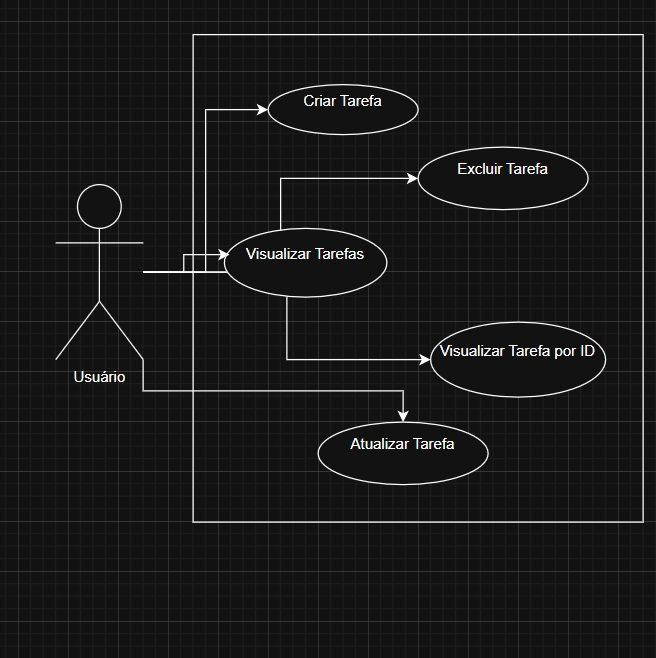
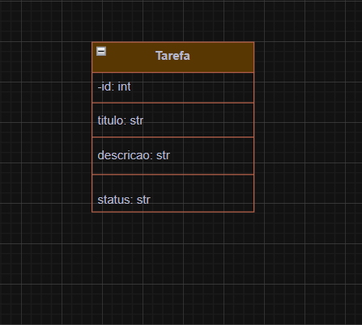

# Sistema de Gerenciamento de Tarefas Ágil (TechFlow Solutions)

## 1. Objetivo do Projeto

O objetivo deste projeto é desenvolver um sistema básico de gerenciamento de tarefas, utilizando princípios de metodologias ágeis. Este sistema permitirá acompanhar o fluxo de trabalho, gerenciar tarefas (CRUD - Criar, Ler, Atualizar, Deletar) e demonstrar conceitos de engenharia de software como controle de qualidade e gestão de mudanças.

## 2. Escopo do Projeto

A versão inicial deste sistema focará em um CRUD completo para tarefas, permitindo as seguintes operações:
* **Criação:** Adicionar novas tarefas com título, descrição e status.
* **Leitura:** Visualizar todas as tarefas ou uma tarefa específica por ID.
* **Atualização:** Modificar informações de tarefas existentes.
* **Exclusão:** Remover tarefas do sistema.

## 3. Metodologia Adotada

Este projeto segue uma abordagem ágil, utilizando princípios do **Kanban** para gerenciamento do fluxo de trabalho. As tarefas são organizadas e acompanhadas na aba [Projects do GitHub]([https://github.com/users/AlanADS753/projects/5/views/1]).

## 4. Requisitos do Sistema

### 4.1. Requisitos Funcionais (RF)

* **RF001 - Criação de Tarefa:** O sistema deve permitir que um usuário crie uma nova tarefa, fornecendo um título, uma descrição e, opcionalmente, um status.
* **RF002 - Visualização de Tarefas:** O sistema deve permitir que um usuário visualize a lista completa de todas as tarefas existentes.
* **RF003 - Visualização de Tarefa por ID:** O sistema deve permitir que um usuário visualize os detalhes de uma tarefa específica, fornecendo seu identificador único (ID).
* **RF004 - Atualização de Tarefa:** O sistema deve permitir que um usuário atualize o título, a descrição e/ou o status de uma tarefa existente, fornecendo seu identificador único (ID) e os novos dados.
* **RF005 - Exclusão de Tarefa:** O sistema deve permitir que um usuário exclua uma tarefa existente, fornecendo seu identificador único (ID).
* **RF006 - Persistência de Dados:** O sistema deve armazenar as informações das tarefas de forma persistente (neste caso, em um arquivo `tasks.json`) para que os dados não sejam perdidos ao reiniciar a aplicação.

### 4.2. Requisitos Não Funcionais (RNF)

* **RNF001 - Performance:** O sistema deve responder às requisições da API em um tempo razoável (ex: abaixo de 500ms para operações CRUD básicas).
* **RNF002 - Usabilidade (API):** A API deve ser intuitiva e seguir padrões RESTful para facilitar o consumo por outras aplicações.
* **RNF003 - Confiabilidade:** O sistema deve garantir a integridade dos dados das tarefas, evitando corrupção ou perda de informações.
* **RNF004 - Manutenibilidade:** O código-fonte deve ser modular, claro, com comentários explicativos e seguir boas práticas de programação para facilitar futuras manutenções e evoluções.
* **RNF005 - Testabilidade:** O sistema deve possuir testes automatizados que garantam o correto funcionamento das funcionalidades implementadas.
* **RNF006 - Segurança (Básico):** O acesso à API deve ser via HTTPS (considerando que na implantação real, e não no desenvolvimento local, isso seria configurado).
* **RNF007 - Escalabilidade (Básico):** A arquitetura inicial deve permitir uma futura expansão para um volume maior de dados e usuários, sem a necessidade de reestruturação completa (considerando a evolução de JSON para DB, por exemplo).
* **RNF008 - Portabilidade:** O sistema deve ser capaz de ser executado em diferentes sistemas operacionais (Windows, Linux) com as mesmas dependências e configurações.

## 5. Modelagem UML

A arquitetura do sistema foi modelada utilizando os seguintes diagramas UML, conforme solicitado:

### 5.1. Diagrama de Casos de Uso

Representa as funcionalidades do sistema sob a perspectiva do usuário.

### 5.2. Diagrama de Classes

Descreve a estrutura estática do sistema em termos de suas classes, atributos e seus relacionamentos.

6. Implementação Completa do CRUD (app.py)
O arquivo app.py contém a lógica principal da API de gerenciamento de tarefas, implementando todas as operações CRUD (Create, Read, Update, Delete) de forma completa e persistente em um arquivo JSON.

6.1. Funções de Suporte
load_tasks(): Responsável por ler as tarefas existentes do arquivo tasks.json. Se o arquivo não existir ou estiver vazio/corrompido, retorna uma lista vazia. Isso garante que a aplicação sempre comece com um estado válido.

save_tasks(tasks): Recebe a lista atual de tarefas e a escreve de volta no arquivo tasks.json. A formatação com indent=4 e ensure_ascii=False é utilizada para manter o arquivo legível e suportar caracteres especiais (acentos, etc.).

6.2. Rotas da API (Endpoints)
6.2.1. Criação de Tarefa (POST /tasks)
Endpoint: /tasks

Método: POST

Descrição: Permite adicionar uma nova tarefa ao sistema. O ID da tarefa é gerado automaticamente, e o status padrão é "A Fazer" se não for fornecido na requisição.

Requisição (JSON Body):

{
    "titulo": "Título da Tarefa",
    "descricao": "Descrição detalhada da tarefa",
    "status": "A Fazer" (opcional)
}

Resposta (Exemplo): 201 Created e a tarefa criada.

6.2.2. Listar Todas as Tarefas (GET /tasks)
Endpoint: /tasks

Método: GET

Descrição: Retorna uma lista contendo todas as tarefas salvas no sistema.

Resposta (Exemplo): 200 OK e uma lista de tarefas.

6.2.3. Obter Tarefa por ID (GET /tasks/<int:task_id>)
Endpoint: /tasks/<int:task_id> (onde <int:task_id> é o ID numérico da tarefa)

Método: GET

Descrição: Busca e retorna os detalhes de uma tarefa específica usando seu ID.

Resposta (Exemplo):

200 OK e a tarefa encontrada.

404 Not Found se a tarefa não existir.

6.2.4. Atualizar Tarefa (PUT /tasks/<int:task_id>)
Endpoint: /tasks/<int:task_id>

Método: PUT

Descrição: Atualiza os campos (titulo, descricao, status) de uma tarefa existente. Apenas os campos fornecidos na requisição serão atualizados, mantendo os demais inalterados.

Requisição (JSON Body):

{
    "titulo": "Novo Título" (opcional),
    "status": "Concluída" (opcional)
}

Resposta (Exemplo):

200 OK e a tarefa atualizada.

404 Not Found se a tarefa não existir.

6.2.5. Excluir Tarefa (DELETE /tasks/<int:task_id>)
Endpoint: /tasks/<int:task_id>

Método: DELETE

Descrição: Remove uma tarefa do sistema permanentemente, usando seu ID.

Resposta (Exemplo):

204 No Content (indica sucesso sem conteúdo para retornar).

404 Not Found se a tarefa não existir.

7. Interface de Usuário (Frontend HTML)
Uma interface de usuário simples foi desenvolvida em HTML, CSS (utilizando Tailwind CSS via CDN) e JavaScript puro para permitir a interação direta com a API Flask do Gerenciador de Tarefas. Este frontend atua como um cliente básico para todas as operações CRUD (Criar, Ler, Atualizar, Deletar).

7.1. Como Utilizar
Certifique-se de que a API Flask está em execução: A interface HTML se comunica com o backend Python. Antes de usar o frontend, execute sua aplicação Flask conforme as instruções na seção "Instruções para Execução do Sistema":

python app.py

A API estará disponível em http://127.0.0.1:5000/.

Abra o arquivo index.html no seu navegador web preferido. Você pode fazer isso arrastando o arquivo diretamente para a janela do navegador ou clicando duas vezes no arquivo no seu explorador de arquivos.

7.2. Funcionalidades da Interface
Criar Nova Tarefa: Um formulário dedicado permite inserir o título, descrição e status de uma nova tarefa.

Listar Tarefas: Exibe todas as tarefas existentes em tempo real, com a opção de atualizar a lista manualmente.

Atualizar Tarefa: Um formulário permite modificar o título, descrição e/ou status de uma tarefa existente, informando seu ID.

Deletar Tarefa: Permite remover uma tarefa do sistema fornecendo o seu ID.

8. Testes Automatizados (tests/test_app.py)
Para garantir a qualidade e o correto funcionamento da API, o projeto inclui um conjunto abrangente de testes automatizados. Estes testes, desenvolvidos com a biblioteca Pytest, verificam o comportamento esperado de cada rota CRUD do backend.

8.1. Estrutura dos Testes
Os testes estão organizados no arquivo tests/test_app.py e cobrem os seguintes cenários para cada operação:

Criação de Tarefas (POST /tasks):

Criação bem-sucedida de uma tarefa com todos os campos.

Verificação do status padrão (A Fazer) quando o status não é fornecido.

Tratamento de erros quando o título da tarefa está ausente.

Listagem de Tarefas (GET /tasks):

Comportamento ao listar tarefas quando a lista está vazia.

Retorno correto de múltiplas tarefas criadas.

Obtenção de Tarefa por ID (GET /tasks/<id>):

Retorno de uma tarefa específica quando o ID existe.

Tratamento de erro (404 Not Found) quando a tarefa não é encontrada.

Atualização de Tarefas (PUT /tasks/<id>):

Atualização bem-sucedida de todos os campos de uma tarefa.

Atualização parcial de campos, garantindo que os campos não fornecidos permaneçam inalterados.

Tratamento de erro (404 Not Found) quando a tarefa a ser atualizada não existe.

Tratamento de erro (400 Bad Request) quando nenhum dado é fornecido para atualização.

Exclusão de Tarefas (DELETE /tasks/<id>):

Deleção bem-sucedida de uma tarefa, verificando se ela é removida da lista.

Tratamento de erro (404 Not Found) ao tentar deletar uma tarefa que não existe.

Tratamento de erro (404 Not Found) ao tentar deletar uma tarefa de uma lista vazia.

8.2. Como Rodar os Testes
Para executar os testes localmente, certifique-se de ter o pytest instalado (pip install pytest) e, na raiz do projeto, execute o comando:

pytest tests/

9. Controle de Qualidade (Integração Contínua com GitHub Actions)
Este projeto utiliza GitHub Actions para automatizar o processo de controle de qualidade e integração contínua (CI). Isso significa que cada alteração no código é automaticamente verificada para garantir que não introduza novos problemas.

9.1. Como Funciona
Configuração: O pipeline de CI é definido no arquivo .github/workflows/ci.yml. Este arquivo descreve uma série de passos que são executados em um ambiente isolado.

Gatilho (Trigger): O workflow é acionado automaticamente em duas situações principais:

Quando há um push (envio de código) para o branch main.

Quando um pull request é aberto com destino ao branch main.

Execução:

Uma máquina virtual (nesse caso, Linux com ubuntu-latest) é provisionada.

O código do repositório é baixado.

O ambiente Python é configurado.

As dependências do projeto (listadas em requirements.txt) e o pytest são instalados.

Os testes automatizados (pytest tests/) são executados.

Feedback: O resultado da execução (sucesso ou falha) é exibido diretamente na aba "Actions" do seu repositório no GitHub, fornecendo feedback rápido sobre a qualidade das novas modificações.

9.2. Verificando as Execuções
Você pode monitorar o status das execuções do CI/CD visitando a aba Actions do GitHub do seu repositório.

